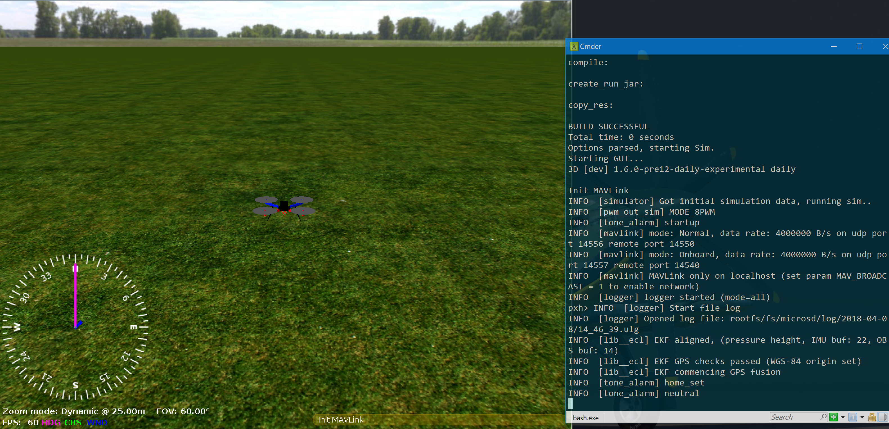

!REDIRECT "https://docs.px4.io/master/ko/dev_setup/dev_env_windows_bash_on_win.html"

# 윈도우용 배시 툴체인

> **Note** [윈도우 Cygwin 툴체인](../setup/dev_env_windows_cygwin.md)이 (유일하게) 윈도우 환경에서 공식적으로 지원하는 툴체인입니다.

윈도우 사용자는 대신 *약간 수정한* 우분투 리눅스 PX4 개발 환경을 [윈도우용 배시](https://github.com/Microsoft/BashOnWindows)에 설치할 수 있고 다음 항목을 활용할 수 있습니다:

* NuttX/픽스호트 대상 펌웨어 빌드.
* PX4 jMAVSim 모의시험 환경 실행(인터페이스를 띄울 때 윈도우에서 제공하는 X-Window 앱 활용)

> **Note** 이 매커니즘은 윈도우 10에서만 동작합니다. 핵심적인 부분은 가상 머신에서 툴체인으로 동작하며 다른 솔루션보다는 상대적으로 느립니다.

### 환경 설치

환경을 설치하는 가장 간단한 방법은 **<a href="https://raw.githubusercontent.com/PX4/Devguide/{{ book.px4_version }}/build_scripts/windows_bash_nuttx.sh" target="_blank" download>windows_bash_nuttx.sh</a>** 스크립트를 활용하는 방법입니다(스크립트 동작의 세부내용은 [아래에 있습니다](#build_script_details))

개발 환경을 설치하려면:

1. [윈도우용 배시](https://github.com/Microsoft/BashOnWindows)를 설치하십시오.
2. 배시 셸을 여십시오.
3. **windows_bash_nuttx.sh** 스크립트를 다운로드하십시오:  
    `wget https://raw.githubusercontent.com/PX4/Devguide/{{ book.px4_version }}/build_scripts/windows_bash_nuttx.sh`
4. 다음 명령으로 스크립트를 실행하십시오(필요할 경우 프롬프트에 응답): 
        sh
        bash windows_bash_nuttx.sh

### 펌웨어 빌드

펌웨어를 빌드하려면 (예: px4_fmu-v4):

1. 다음 명령을 배시셸에 입력하십시오:
    
        cd ~/src/PX4-Autopilot
        make px4_fmu-v4_default
        
    
    On successful completion you'll find the firmware here: `PX4-Autopilot/build/px4_fmu-v4_default/px4_fmu-v4_default.px4`
    
    > **Note** 기타 보드 대상 펌웨어 빌드용 `make` 명령은 [코드 빌드](../setup/building_px4.md#nuttx)에서 확인하실 수 있습니다

2. *QGroundControl* 또는 *Mission Planner* 로 윈도우에서 개별 펌웨어를 플래싱할 수 있습니다(배시 셸에서 `upload` 명령으로 펌웨어를 바로 플래싱할 수는 없습니다).

### 모의시험 환경(jMAVSim)

윈도우용 배시에서는 UI 라이브러리를 지원하지 않습니다. jMAVSim 인터페이스를 화면에 띄우려면 [XMing](https://sourceforge.net/projects/xming/) 같은 X-Window 프로그래을 윈도우에 우선 설치해야합니다.

jMAVSim 을 설치하려면:

1. 윈도우에 [XMing](https://sourceforge.net/projects/xming/)을 설치하고 시작하십시오.
2. 다음 명령을 배시셸에 입력하십시오: 
        sh
        export DISPLAY=:0 > 
    
    **Tip** 매 세션을 열 때마다 입력을 원치 않으면 우분투 **.bashrc** 파일에 이 행을 추가하십시오.
3. PX4와 jMAVSim 을 배시셸에서 시작하십시오:
    
    ```sh
    make px4_sitl jmavsim
    ```
    
    이후 아래와 같이 XMing 창에 jMAVSim 인터페이스가 뜹니다:
    
    

> **Caution** 가제보는 윈도우용 우분투 배시에서 비슷하게 실행할 수 있지만, 쓸만하기에는 너무 느립니다. 그래도 써보시겠다면 [ROS 키네틱 설치 안내서](http://wiki.ros.org/kinetic/Installation/Ubuntu)를 따라 설치후 다음과 같이 배시셸에서 가제보를 실행해보십시오: 
> 
>     sh
>       export DISPLAY=:0
>       export GAZEBO_IP=127.0.0.1
>       make px4_sitl gazebo

<a id="build_script_details"></a>

### Build Script Details

The [windows_bash_nuttx.sh](https://raw.githubusercontent.com/PX4/Devguide/{{ book.px4_version }}/build_scripts/windows_bash_nuttx.sh) build script modifies the Ubuntu build instructions to remove Ubuntu-specific and UI-dependent components, including the *Qt Creator* IDE and the simulators.

In addition, it uses a [64 bit arm-none-eabi compiler](https://github.com/SolinGuo/arm-none-eabi-bash-on-win10-.git) since BashOnWindows doesn't run 32 bit ELF programs (and the default compiler from `https://launchpad.net/gcc-arm-embedded` is 32 bit).

To add this compiler to your environment manually:

1. 컴파일러를 다운로드하십시오: 
        sh
        wget https://github.com/SolinGuo/arm-none-eabi-bash-on-win10-/raw/master/gcc-arm-none-eabi-5_4-2017q2-20170512-linux.tar.bz2

2. 윈도우용 배시 콘솔에서 이 명령행으로 압축을 풀어내십시오: 
        sh
        tar -xvf gcc-arm-none-eabi-5_4-2017q2-20170512-linux.tar.bz2 이 명령은 다음 경로로 ARM GCC 교차 컴파일러를 풀어냅니다: ```gcc-arm-none-eabi-5_4-2017q2/bin```

3. 다음 행을 PATH 환경 변수에 추가하십시오(배시 프로파일에 아래 행을 추가하면 앞으로도 바뀐 내용을 계속 반영합니다) ```export PATH=$HOME/gcc-arm-none-eabi-5_4-2017q2/bin:$PATH```