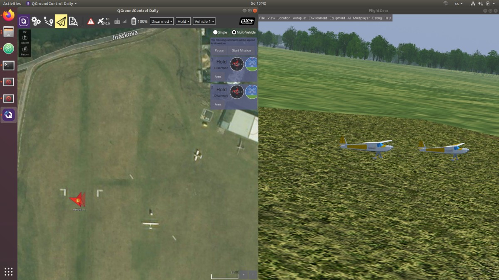

!REDIRECT "https://docs.px4.io/master/ko/simulation/multi_vehicle_flightgear.html"

# Multi-Vehicle Simulation with FlightGear

This topic explains how to simulate multiple vehicles using FlightGear in SITL. All vehicle instances have parameters defined by their startup scripts.

> **Note** This is the most environmentally realistic way to simulate multiple vehicles running PX, and allows easy testing of multiple different types of vehicles. *QGroundControl*, [MAVSDK](https://mavsdk.mavlink.io/) 등에서 다중 기체 지원 여부를 시험해보기에 적합합니다. [Multi-Vehicle Simulation with Gazebo](../simulation/multi-vehicle-simulation.md)를 대신 활용하는게 좋습니다. 다중 기체의 무리 비행 모의시험, 가제보에서만 지원하는 컴퓨터 비전 기능 시험.


## How to Start Multiple Instances

To start multiple instances (on separate ports and IDs):

1. Checkout the [PX4 branch that supports multiple vehicles](https://github.com/ThunderFly-aerospace/PX4Firmware/tree/flightgear-multi) (at ThunderFly-aerospace):
   ```bash
   git clone https://github.com/ThunderFly-aerospace/PX4Firmware.git
   cd PX4Firmware
   git checkout flightgear-multi  
   ```
1. Build the PX4 Firmware using the standard toolchain (with FlightGear installed).
1. Start the first instance using the [predefined scripts](https://github.com/ThunderFly-aerospace/PX4-FlightGear-Bridge/tree/master/scripts):
   ```bash
   cd ./Tools/flightgear_bridge/scripts
   ./vehicle1.sh
   ```
1. Start subsequent instances using another script:
   ```bash
   ./vehicle2.sh
   ```

Each instance should have its own startup script, which can represent a completely different vehicle type. For prepared scripts you should get the following view.



*QGroundControl*같은 지상 통제 장치에서는 일반 UDP 포트 14550 번으로 모든 인스턴스에 연결합니다(모든 트래픽은 동일한 포트로 들어갑니다).

The number of simultaneously running instances is limited mainly by computer resources. FlightGear is a single-thread application, but aerodynamics solvers consume a lot of memory. Therefore splitting to multiple computers and using a [multiplayer server](http://wiki.flightgear.org/index.php?title=Howto:Multiplayer) is probably required to run *many* vehicle instances.

## Additional Resources

* See [Simulation](../simulation/README.md) for more information about the port configuration.
