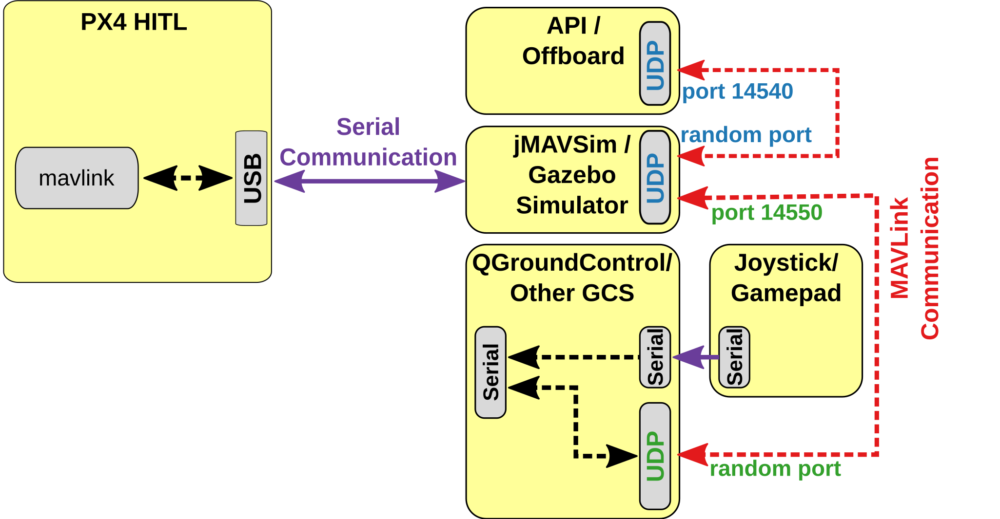
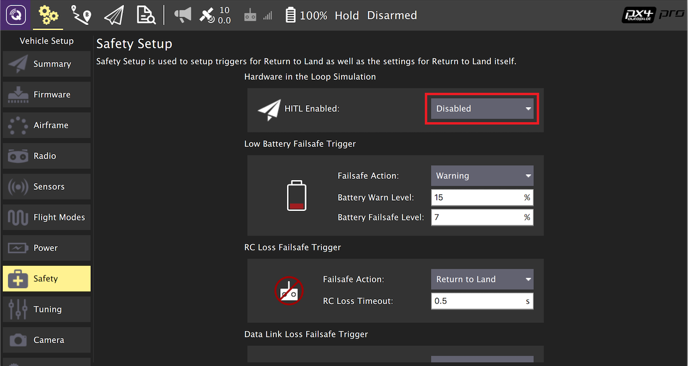
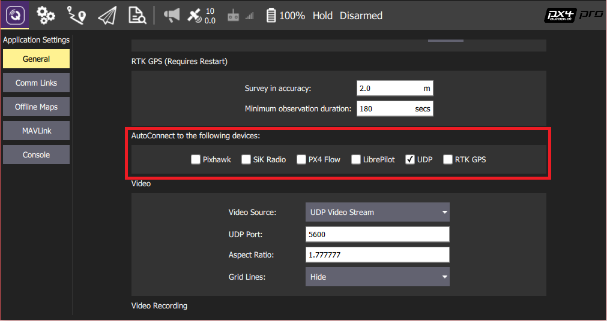

!REDIRECT "https://docs.px4.io/master/zh/simulation/hitl.html"

# 硬件在环仿真（HITL）

硬件在环仿真模式 (HITL 或 HIL) 下 PX4 固件代码运行在真实的飞行控制器硬件平台上。 这种方法的优点是可以在实际硬件上测试大多数的实际飞行代码。

PX4 supports HITL for multicopters (using jMAVSim or Gazebo) and VTOL (using Gazebo).

<a id="compatible_airframe"></a>

## HITL-Compatible Airframes

The current set of compatible airframes vs Simulators is:

| 机架                                                                                                     | `SYS_AUTOSTART` | Gazebo | jMAVSim |
| ------------------------------------------------------------------------------------------------------ | --------------- | ------ | ------- |
| <a href="../airframes/airframe_reference.md#copter_simulation_(copter)_hil_quadcopter_x">HIL Quadcopter X</a>                                                                              | 1001            | Y      | Y       |
| <a href="../airframes/airframe_reference.md#vtol_standard_vtol_hil_standard_vtol_quadplane">HIL Standard VTOL QuadPlane</a>                                                                              | 1002            | Y      |         |
| [Generic Quadrotor x](../airframes/airframe_reference.md#copter_quadrotor_x_generic_quadcopter) copter | 4001            | Y      | Y       |
| [DJI Flame Wheel f450](../airframes/airframe_reference.md#copter_quadrotor_x_dji_flame_wheel_f450)     | 4011            | Y      | Y       |

<a id="simulation_environment"></a>

## HITL Simulation Environment

With Hardware-in-the-Loop (HITL) simulation the normal PX4 firmware is run on real hardware. JMAVSim or Gazebo (running on a development computer) are connected to the flight controller hardware via USB/UART. The simulator acts as gateway to share MAVLink data between PX4 and *QGroundControl*.

> **Note** 如果飞行控制器支持网络连接且使用的是稳定、低延迟的连接（如有线以太网，WIFI 通常不太稳定），那么模拟器也可以使用 UDP 完成通讯连接。 For example, this configuration has been tested with PX4 running on a Raspberry Pi connected via Ethernet to the computer (a startup configuration that includes the command for running jMAVSim can be found [here](https://github.com/PX4/PX4-Autopilot/blob/master/posix-configs/rpi/px4_hil.config)).

The diagram below shows the simulation environment:

* 飞控板 HITL 模式被激活 (通过 *QGroundControl*) ，该模式下不会启动飞控板上任何传感器。
* *jMAVSim* 或者 *Gazebo* 通过 USB 连接到飞控板。
* 模拟器通过 UDP 连接到 *QGroundControl* 并将 MAVLink 数据传输至 PX4 。
* *Gazebo*和*jMAVSim*也可以连接到 offboard API和桥接MAVLink消息到 PX4。
* (可选) 通过串口可将操纵杆/游戏手柄通过 *QGroundControl* 连接至仿真回路中。



## HITL 相比于 SITL

SITL runs on a development computer in a simulated environment, and uses firmware specifically generated for that environment. Other than simulation drivers to provide fake environmental data from the simulator the system behaves normally.

By contrast, HITL runs normal PX4 firmware in "HITL mode", on normal hardware. The simulation data enters the system at a different point than for SITL. Core modules like commander and sensors have HITL modes at startup that bypass some of the normal functionality.

In summary, HITL runs PX4 on the actual hardware using standard firmware, but SITL actually executes more of the standard system code.

## 配置 HITL

### PX4配置

1. 通过 USB 将自动驾驶仪直接连接到 *QGroundControl*。
2. 激活 HITL 模式
    
    1. 打开 **Setup > Safety** 选项卡。
    2. 在 *HITL Enabled* 下拉框中选择 **Enabled** 完成 HITL 模式的激活。
        
        

3. 选择机架
    
    1. 打开 **Setup > Airframes** 选项卡。
    2. 选择一个你想要进行测试的 [兼容的机架](#compatible_airframe) 。 Then click **Apply and Restart** on top-right of the *Airframe Setup* page.
        
        

4. 如有必要, 校准您的 RC 遥控器 或操纵杆。

5. 设置 UDP
    
    1. 在设置菜单的 "*General*" 选项卡下, 取消选中 *AutoConnect* 一栏中除 **UDP** 外的所有复选框。
        
        

6. (可选) 配置操纵杆和故障保护。 Set the following [parameters](https://docs.px4.io/master/en/advanced_config/parameters.html) in order to use a joystick instead of an RC remote control transmitter:
    
    * [COM_RC_IN_MODE](../advanced/parameter_reference.md#COM_RC_IN_MODE) 更改为 "Joystick/No RC Checks". 这允许操纵杆输入并禁用 RC 输入检查。
    * [NAV_RCL_ACT](../advanced/parameter_reference.md#NAV_RCL_ACT) to "Disabled". 这可确保在没有无线遥控的情况下运行 HITL 时 RC 失控保护不会介入。
    
    > **Tip** *QGroundControl User Guide* 中也有如何配置 [操纵杆](https://docs.qgroundcontrol.com/en/SetupView/Joystick.html) 和 [虚拟操纵杆](https://docs.qgroundcontrol.com/en/SettingsView/VirtualJoystick.html) 的说明。

Once configuration is complete, **close** *QGroundControl* and disconnect the flight controller hardware from the computer.

### 模拟器特定设置

Follow the appropriate setup steps for the specific simulator in the following sections.

#### Gazebo

> **Note** 确保 *QGroundControl* 没有运行！

1. 使用 Gazebo 构建PX4 (用于构建Gazebo 插件)。 
        cd <Firmware_clone>
        make px4_sitl_default gazebo

2. 打开飞行器模型的 sdf 文件（例如 **Tools/sitl_gazebo/models/iris/iris.sdf**）。
3. 找到文件的 `mavlink_interface plugin` 分区，将 `serialEnabled` 和 `hil_mode` 参数更改为 `true` 。
    
    
    
    > **Note** iris.sdf文件时自动生成的。 因此，您需要保存您修改过的文件的副本，或者为每个版本重新编辑。

4. 如有必要的话替换掉 `serialDevice` 参数 (`/dev/ttyACM0`) 。
    
    > **Note** 串口设备参数取决于载具与计算机使用哪个端口完成连接 (通常情况下都是 `/dev/ttyACM0`)。 在 Ubuntu 上最简单的一个检测办法就是将自驾仪插入电脑，然后打开终端窗口输入 `dmesg | grep "tty"` 命令。 命令执行结果中最后一个显示的设备就是我们关心的。

5. 设置环境变量
    
    ```sh
    source Tools/setup_gazebo.bash $(pwd) $(pwd)/build/px4_sitl_default
    ```
    
    在 HITL 模式下运行 Gazebo ：:
    
    ```sh
    gazebo Tools/sitl_gazebo/worlds/iris.world
    ```

6. 启动*QGroundControl*。 它应该会自动连接 PX4 和 Gazebo 。

<a id="jmavsim_hitl_configuration"></a>

#### jMAVSim (Quadrotor only)

> **Note** 确保 *QGroundControl* 没有运行！

1. 将飞行控制器连接到计算机, 并等待其启动。
2. 在 HIL 模式下运行 jMAVSim 
        sh
        ./Tools/jmavsim_run.sh -q -d /dev/ttyACM0 -b 921600 -r 250
    
    **Note** 酌情替换序列端口名称`/dev/ttyACM0`。 在 macOS 上，这个端口将是 `/dev/tty.bankmodem1`。 在 Windows 上(包括Cygwin) 它将是 COM1 或另一个端口 - 请检查 Windows 设备管理器中的连接。
3. 开启 *QGroundControl*。 它应该会自动连接 PX4 和 Gazebo 。

## 在 HITL 仿真中执行自主飞行任务

You should be able to use *QGroundControl* to [run missions](../qgc/README.md#planning-missions) and otherwise control the vehicle.